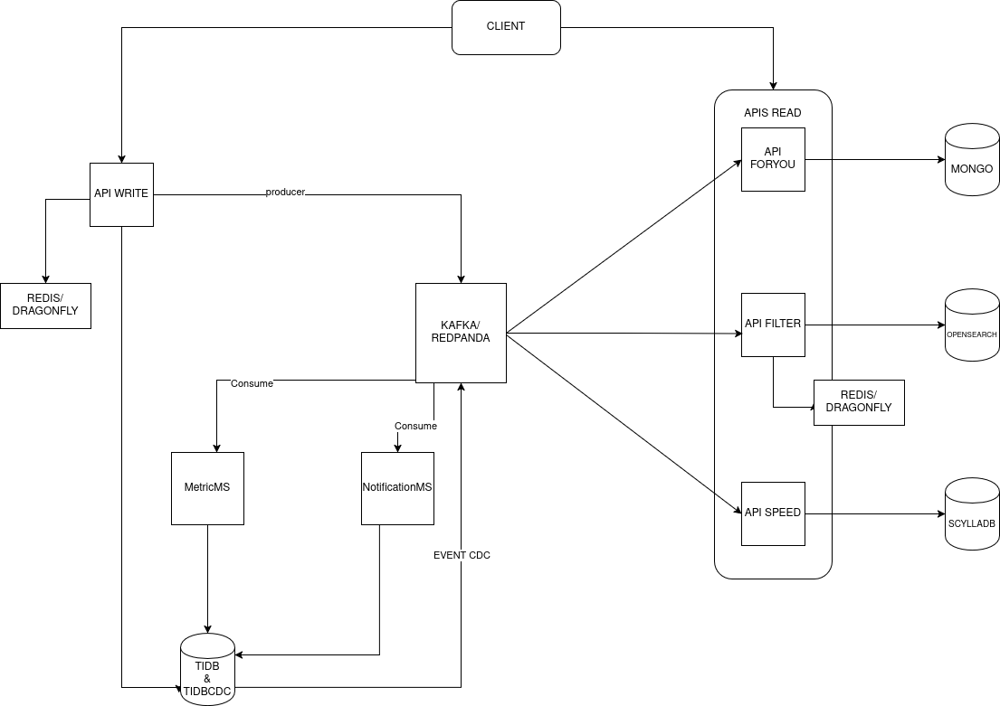

# Simple Social Media — CQRS Distributed Architecture

    A high-performance social media backend designed with a focus on scalability, fault tolerance, and modern distributed     system patterns. This project demonstrates the implementation of CQRS (Command Query Responsibility Segregation) to     handle heavy write loads and high-speed read requirements independently.
    
## Project Status

Ongoing Development

## Architecture Overview
    
    The system is architected as a set of specialized microservices and APIs, each optimized for its specific responsibility.
    
## Core APIs
    Write API (Command Side)
        Built with Spring Boot & Java 21
        Manages:
        Primary business logic
        Complex validations (Snowflake IDs, authorship)
        Transactional integrity
        
    Read API (Query Side)

        Built with Quarkus Reactive
        Optimized for:
            Ultra-low latency
            Serving the frontend
            Querying high-performance read projections
        
## Specialized Microservices

    MS-CDC (Change Data Capture)
        Quarkus Reactive service
        Monitors TiDB binary logs
        Streams data changes to the message broker in real time
    Notification MS
        Dedicated service for the notification bounded context
        Handles:
            Real-time user alerts
            Social triggers
    Email MS
        Asynchronous service built with Quarkus Reactive
        Responsible for:
            Reliable email delivery
            Transactional emails
            Marketing emails
    Metric MS
        Technical microservice
        Aggregates:
            Post metrics
            Comment metrics
        Assists the Write API in maintaining:

          Ranking scores
          Engagement data
          
## Technology Stack
    - Component
    - Technology
    - Rationale
    - Database (Primary)

TiDB
    NewSQL database used for horizontal scalability, ACID transactions, and native CDC capabilities

Message Broker
    Redpanda
        High-performance, Kafka-compatible streaming platform designed for low latency and mission-critical reliability
NoSQL (Read Side)
    ScyllaDB
        Used for read-optimized projections, offering ultra-fast query performance for the reactive frontend
        Runtime Java 21
        Utilizing Virtual Threads and modern language features for efficient concurrency

Infrastructure
    Docker
        Used for containerization and local development orchestration

## Engineering Excellence

    This project is developed following industry-leading software engineering principles:
    CQRS Pattern
    Strict segregation of command and query models to allow independent scaling
    Clean Architecture & SOLID
    Focus on maintainable, testable, and decoupled code
    Reactive Programming
    Heavily utilized on the Read side and Microservices for non-blocking I/O and better resource utilization
    Resilience Patterns
    Implementation of Circuit Breakers and Retry mechanisms to handle transient failures
    Advanced Security
    JWT-based authentication with custom Role-Based Access Control (RBAC)
## Future Roadmap
    Cloud Deployment
        Implementation on AWS and Azure using Terraform (IaC)
    Automated Pipelines
        Full CI/CD integration with automated testing and deployment
    Observability
        Implementing distributed tracing and metrics monitorin
